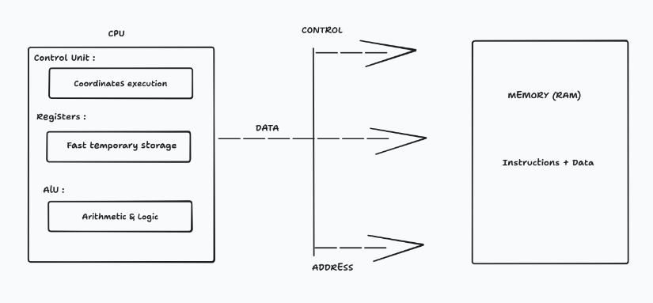
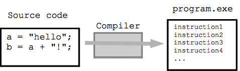
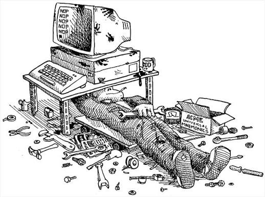

<div align="center">

# ﷽

</div>

## Introduction

Before writing complex programs, it is important to understand what happens underneath the abstractions provided by modern programming languages.

A computer does not directly understand C, C++, Python, or JavaScript. At its lowest level, it executes instructions represented as machine code.

This section introduces the basic components that allow a computer to execute those instructions: the CPU, memory, assembly language, and registers.

---

# Computer Architecture

Computer architecture describes how the different components of a computer are organized and how they work together.

A simplified computer can be represented as:



The main components involved in program execution include:

* **CPU** :           Executes instructions.
* **Memory (RAM)** :  Stores programs and data.
* **Registers** :     Small and extremely fast storage locations inside the CPU.
* **ALU** : Performs arithmetic and logical operations.
* **Control Unit** : Coordinates the execution of instructions.

---

# From Code to the CPU

When writing a program in a high-level language, the CPU cannot execute that source code directly.

The program must eventually be translated into machine instructions.



The CPU ultimately executes instructions encoded as binary.

For example:

```text
10110000 00000001
```

Writing programs directly in binary is extremely difficult. Assembly language provides a human-readable representation of machine instructions.

---

# Assembly Language

Assembly is a low-level programming language that provides a close representation of the instructions executed by a processor.



For example:

```asm
mov rax, 1
```

This instruction moves the value `1` into the `rax` register.

Assembly instructions generally perform simple operations such as:

* Moving data
* Performing arithmetic
* Comparing values
* Jumping to different instructions
* Accessing memory
* Calling functions

Unlike high-level languages, Assembly requires the programmer to interact more directly with the machine.

---

# Registers

Registers are small storage locations located directly inside the CPU.

They are much faster than regular memory and are used constantly while executing instructions.

In the x86-64 architecture, some common registers include:

```text
rax
rbx
rcx
rdx
rsi
rdi
rsp
rbp
rip
```

Registers can store:

* Numbers
* Memory addresses
* Function arguments
* Return values
* Temporary data

For example:

```asm
mov rax, 42
```

After executing this instruction:

```text
rax = 42
```

---

## General-Purpose Registers

Some registers can be used for general operations.

| Register | Common Purpose             |
| -------- | -------------------------- |
| `rax`    | Accumulator / return value |
| `rbx`    | General-purpose            |
| `rcx`    | Counter                    |
| `rdx`    | General-purpose            |
| `rsi`    | Source index               |
| `rdi`    | Destination index          |

Their exact role can depend on the operating system, calling convention, and instruction being executed.

---

## Special Registers

Some registers have particularly important roles.

### rsp

The stack pointer points to the current top of the stack.

```text
Stack
  |
  v
+------------+
|            |
+------------+
|            |
+------------+
|            |
+------------+
|            |
+------------+
       ^
       |
      rsp
```

---

### `rbp` 

The base pointer is often used to reference a function's stack frame.

---

### `rip`

The instruction pointer contains the address of the next instruction to execute.

For example:

```text
Memory

0x1000 → instruction 1
0x1004 → instruction 2
0x1008 → instruction 3
             ^
             |
            rip
```

After executing an instruction, the CPU normally updates `rip` to point to the next instruction.

---

# The Instruction Cycle

At a simplified level, the CPU repeatedly performs the following steps:

```text
        +-------+
        | Fetch |
        +---+---+
            |
            v
        +-------+
        | Decode|
        +---+---+
            |
            v
        +-------+
        |Execute|
        +---+---+
            |
            +----------+
                       |
                       v
                    Repeat
```

### 1. Fetch

The CPU retrieves the next instruction from memory.

### 2. Decode

The CPU determines what operation the instruction represents.

### 3. Execute

The CPU performs the requested operation.

This process happens continuously while a program is running.

---

# Example

Consider the following Assembly instructions:

```asm
mov rax, 10
mov rbx, 20
add rax, rbx
```

Step by step:

```text
mov rax, 10

rax = 10
```

```text
mov rbx, 20

rbx = 20
```

Then:

```asm
add rax, rbx
```

The CPU performs:

```text
rax = rax + rbx
```

Result:

```text
rax = 30
```

---

# Key Takeaways

* A CPU executes machine instructions.
* Assembly provides a human-readable representation of those instructions.
* Registers are extremely fast storage locations inside the CPU.
* Programs and data are stored in memory.
* The CPU continuously fetches, decodes, and executes instructions.
* Understanding these concepts is the first step toward understanding how computers work at a low level.
---

# References

- [Computer Architecture - Wikipedia](https://en.wikipedia.org/wiki/Computer_architecture)
- [CPU Architecture Explained - YouTube](https://www.youtube.com/watch?v=GtVDTp826DE)